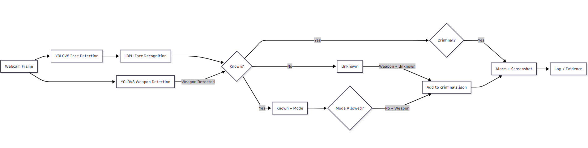
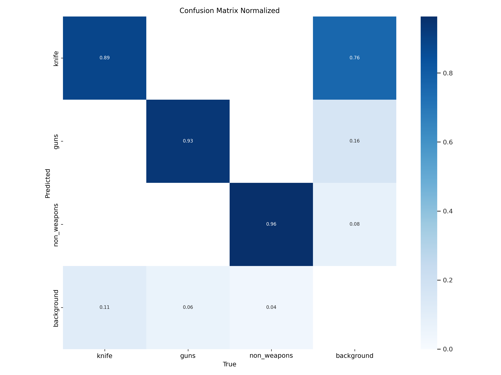

## Security Detection: Face, Weapon, and Criminal Recognition (Real-time)

An end-to-end system that detects weapons (guns/knives), recognizes faces, and maintains a persistent list of criminals. The system triggers alarms and captures evidence on criminal detection.

### Problem Description
Traditional CCTV lacks real-time context. This project fuses face recognition and weapon detection to: (1) flag unknown individuals holding weapons, (2) enforce per-user weapon permissions, and (3) instantly alert on known criminals with visual evidence.

### How It Works (Overview)
The pipeline combines a YOLO-based detector with LBPH face recognition, maintaining user modes and a criminals registry.



### Core Logic: Three Cases
- **Unknown person holding weapon (gun/knife)**: Add to `criminals.json` for future detection.
- **Known person with modes (allowed / not allowed)**: If not allowed and holding weapon → add to criminals.
- **Criminal detected (with or without weapon)**: Play alarm and capture screenshot.

### Model Components
- **Face Recognition**: YOLO face detection + LBPH recognizer (`trainneruser.yml`).
- **Weapon Detection**: YOLO model detecting guns and knives.
- **Criminal Registry**: `criminals.json` maintained by the pipeline and `tracker.py`.

---

## Confusion Matrix
Below is the normalized confusion matrix for the weapon detector. Use it to understand class-wise performance and common confusions.



---

## Real-time Demo
- Weapon model demo (guns/knives): [YouTube link pending]
- Full pipeline demo (faces + modes + alarm + screenshots): [YouTube link pending]

> Once links are available, replace the placeholders above. Optionally add short GIF previews under `static/img/`.

---

## Quick Start

### Requirements
Install Python 3.9+ and dependencies:

```bash
pip install -r requirments.txt
```

### Prepare Data
- Ensure `users.json` and `trainneruser.yml` exist for known users.
- Use `create.py` to register a new user (captures 60 face images and retrains).

### Run
- Register user: `python create.py`
- Recognize / monitor users: `python detector.py`
- Criminal capture flow (screenshots + retrain): `python tracker.py`
- Weapon-only demo: `python weaponDetect.py`
- Combined live demo (faces + weapons): use `live_detection()` in `detector.py`

---

## Project Structure (Key Files)

```
create.py           # Register user and retrain
detector.py         # Face recognition, criminals, live detection
tracker.py          # Hand/object overlap, capture screenshots, update criminals
weaponDetect.py     # Weapon-only detection demo
trainner.py         # Training utilities (LBPH)
users.json          # Known users with modes (allowed / not allowed)
criminals.json      # Criminal registry
models/             # Model weights (YOLO)
static/, templates/ # Web/static assets (if applicable)
```

---

## Streamlit App (TODO)
- Live monitoring dashboard
- Recent detections and screenshots
- Toggle user modes (allowed/not allowed)
- Start/stop camera pipelines

---

## Ethics & Disclaimer
Use responsibly and comply with local laws and privacy regulations. Models may exhibit bias or errors; always keep a human in the loop for critical decisions.

## License
MIT (or update to your chosen license)

## Contributors
Supervisor: Dr/Wael Zakriya
1. [Ahmed Abdelgelel](https://github.com/Ahmed-abdelgalil)
2. [Ahmed Salem](https://github.com/el3amed74)
3. [Youssef Tarek](https://github.com/yousseftarek2001)
4. [Mohamed Medhat](https://github.com/mohamedmedhat1)

## Contributing
Contributions are welcome! Feel free to open issues or PRs.
